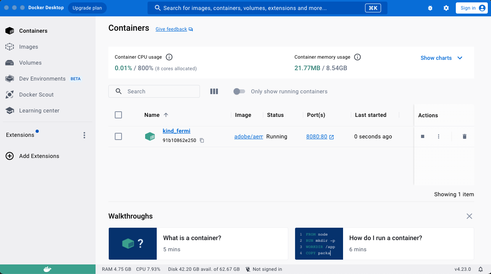
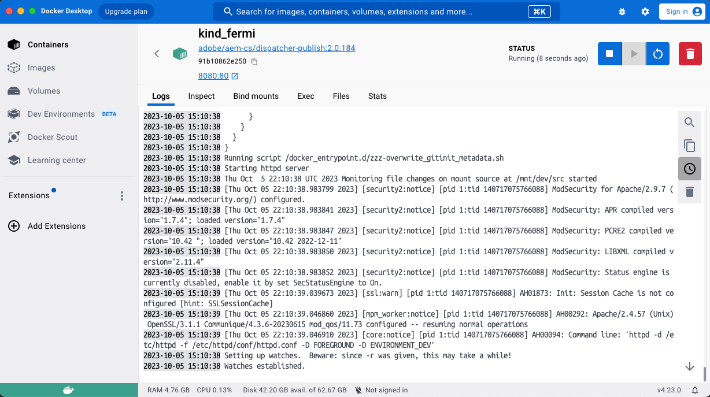
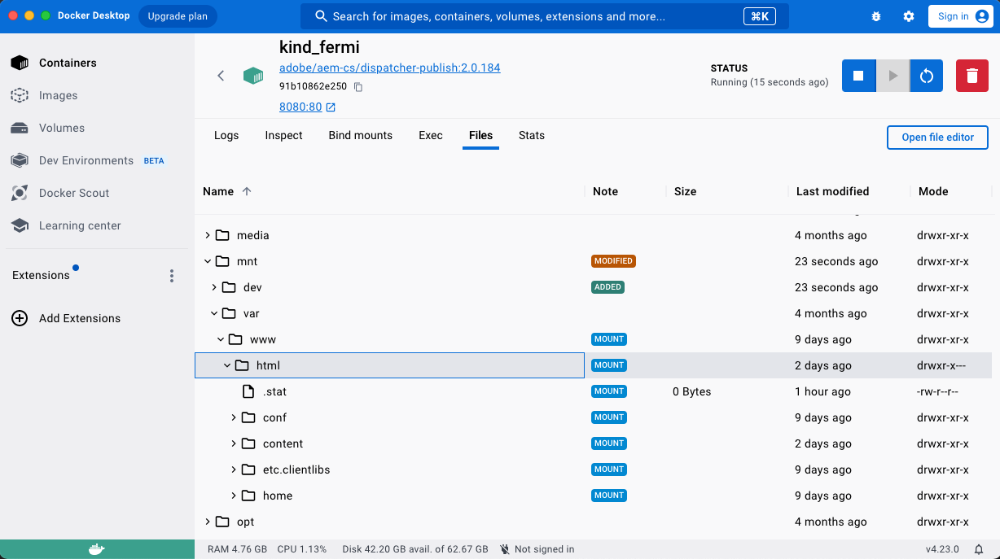
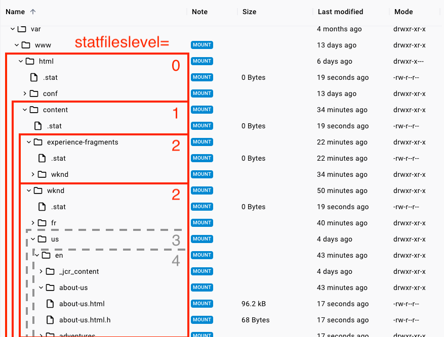
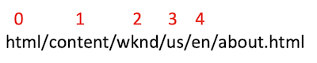
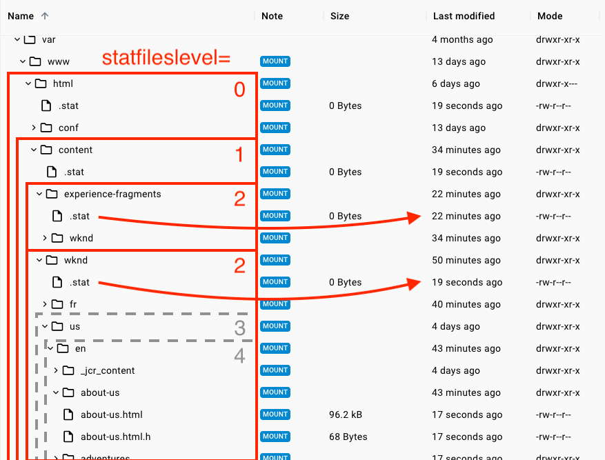
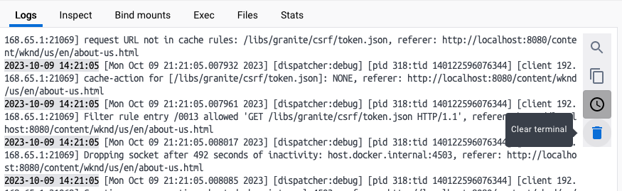

# Understanding Dispatcher Using Docker

For the first few years that AEMaaCS was available, the Dispatcher SDK running in Docker had a disadvantage. With the provided start scripts, the cached folder and file structure were inside the running Docker container, thus invisible to MacOS Finder or Windows Explorer. This left a couple of options when troubleshooting:

* Open a terminal and navigate the cache using command line. For those more used to GUIs this made things hard, and even for command line experts seeing changes required additional steps.
* Customize the start scripts and have Docker mount the files outside the container in a specified hard disk path. This required knowledge and time to apply script changes every time a new SDK was released. 

Luckily, Docker Desktop introduced an experimental feature in February 2023 which shortly after became standard. This is called Container File Explorer. If you haven't updated Docker Desktop in some time, pause your reading and do it now!

> Even in late 2023, many developers and architects are not aware of Docker's Container File Explorer. Don't keep it a secret, and you may make someone's day!

## Looking Inside a Docker Container

If you have a running Author/Publish/Dispatcher stack running as configured in [our previous lesson](local-aemaacs-stack.md), when you open the Docker Desktop window you will see a container with a randomized name.



After clicking the container name, several tabs can be seen starting with **Logs**. This can be a nice alternative to the Terminal window used to to start the SDK. 

> Note: If you've ever encountered Dispatcher seeming to randomly shut down with a message like "caught SIGWINCH, shutting down gracefully", this is because the Terminal it's running in was resized. It may work best to leave that fragile window in the background and view log messages using Docker Desktop!



When you click the Files tab, you will be presented with the Container File Explorer. You can click down to /mnt/var/html. This is the "docroot" of the files cached within the dispatcher. Below we can see cached:

* Content
* Configurations (mostly template resources in conf)
* Client libraries (CSS/JS/icons and more in etc.clientlibs)



## Change Dispatcher Log Level to Better Understand Behavior

Before we dive in further, let's change our dispatcher log level from **info** to **debug** so we can better follow what's happening.

1. **Open /dispatcher/src/conf.d/variables/global.vars**
1. Remove the # in front of DISP_LOG_LEVEL to uncomment the line.
1. Change the value to **debug** and save the changed file.

        ```dispatcher
        # Log level for the dispatcher
        #
        # Possible values are: Error, Warn, Info, Debug and Trace1
        # Default value: Warn
        #
        Define DISP_LOG_LEVEL debug
        ```

1. If you are working in MacOS and used the docker_run_hot_reload.sh script, the changes should automatically sync to the Dispatcher running in Docker.
    * If you are in Windows, you will have to restart dispatcher to apply this and any other changes going forward.
    * This can be done by opening the Terminal window where Docker is running, pressing Ctrl + C to stop it, then rerunning the start command documented in [the previous tutorial](local-aemaacs-stack.md).

## Dispatcher Cache Clearing - The Stat File

It is often said that caching content is easy, but invalidating (aka flushing) that cache is hard. Keep in mind that pages contain references to a variety of other content. This reference could be simple hyperlinks, or the content of an Experience Fragment being "baked in" as part of the page.

Consider the case where a page is renamed and that change is published. Every page which links to it needs to have its cached copies flushed. Otherwise, the cached pages will contain links to the old page path which will now be broken.

To best ensure cache freshness and accuracy, the default behavior of the Dispatcher is to clear all cached pages of a site upon publishing of any page under it. For example, we will publish the page at **/content/wknd/us/en/about.html**. Note:

* All Dispatcher cache is cleared below **/html/content/wknd**
* Cache under neighboring paths like    **/html/content/experience-fragments** is left untouched.

This is because of the setting called **statfileslevel** is set at 2. You can find this setting under /dispatcher/src/conf.dispatcher.d/available_farms/wknd.farm

The functionality of this setting is best explained visually, and is one of the many behaviors of dispatcher that is more easily understood in Docker where you can see the effects. Look at the file structure around the **about.html** example:



The page that was changed and published was a 4th level page due to its path



But, because WKND dispatcher is set to statfileslevel=2, the modification time of resources is only noted at level 2. Take another look at the file structure in Docker, and note the **.stat** files created under each folder



In the above image, you can see

* **/html/content/wknd/.stat** was modified (or "touched" as we say in Dispatcher terminology) 19 seconds ago when the page was published.
  * The next time any page under **/html/content/wknd/...** is requested, any cached copy older than this timestamp will be replaced with a freshly rendered copy from the Publish server.
* **/html/content/experience-fragments/.stat** has an older modified time of 22 minutes ago.
  * This path was not affected by the publishing of content in a sibling level 2 tree.
  * Content under this path was last published 22 minutes ago, so any cached resources newer than that remain valid and can be served without requesting them to be re-rendered in the publish server.

## Hands On Activity

If you haven't already, try modifying and publishing the about-us page

1. Open the page for edit at [http://localhost:4502/editor.html/content/wknd/us/en/about-us.html](http://localhost:4502/editor.html/content/wknd/us/en/about-us.html)
1. As this page is a live-copy from language masters, you will need to either add a component like the Text component, or break inheritance of an existing component to make changes.
    1. You will need to modify page content **every time** before publishing the changes. Although AEM Author doesn't indicate any issue when re-publishing an unchanged page, this will not trigger a dispatcher flush.
    1. An easy way to do this while learning is to use a Text component containing a number, and modify that number before you click Publish
1. To better see how dispatcher reacts while you experiment, you can open the Logs view in Docker and click the **Clear** button to clear past log messages. The log can get rather large, especially when set to debug level.
    
1. Return to AEM Author and use the Publish Page button. This is found by clicking the Settings icon at the top left in Edit view.
    1.  Did you see log statements about ```Activation detected``` in the logs? How about entries mentioning ```.stat```?
    1.  When you look at the Files structure, can you see where the .stat file for this path was last modified?
1. Next, simulate a request for the page from a site visitor.
    1. Opening the page normally will trigger not just a request for the html, but also many other things like fonts, icons, images, etc. For that reason, use a Chrome Incognito browser window and paste the address ```view-source:http://localhost:8080/content/wknd/us/en/about-us.html```
    1. Again, take a look at the Logs tab in Docker. Search for ```cache-action for [/content/wknd/us/en/about-us```
        1.  What was the cache-action? How does it change when you publish changes or request the page multiple times with no change?
        1.  Try searching the logs for the string ```cache file is```. What sort of log statements do you see?
