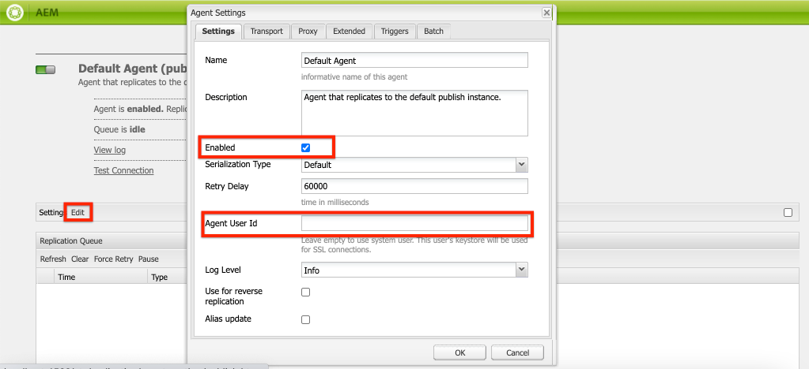
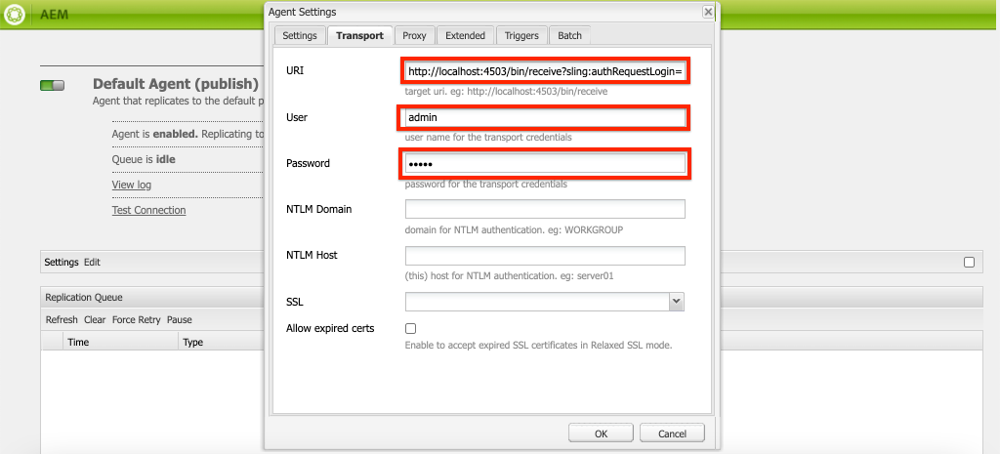
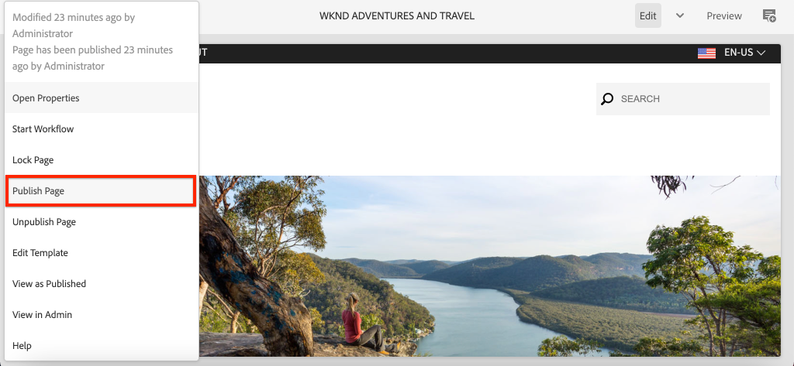
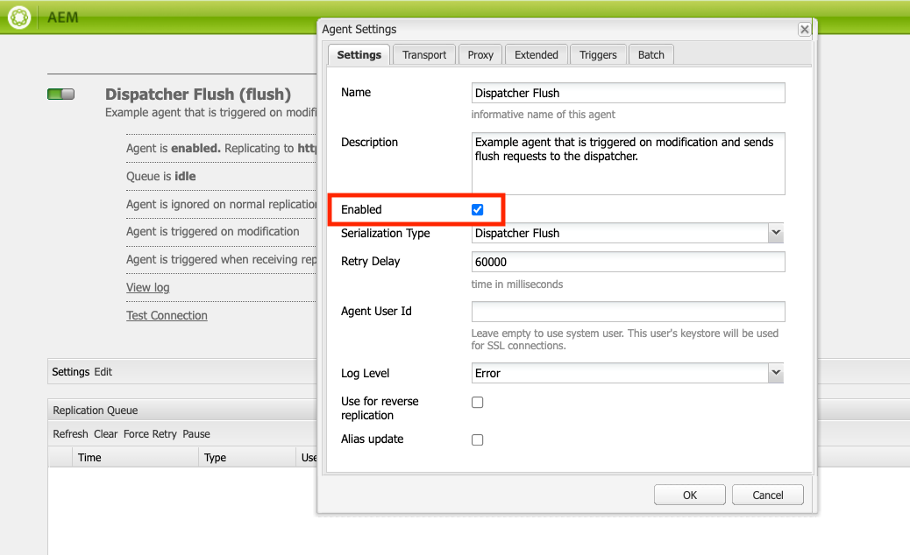
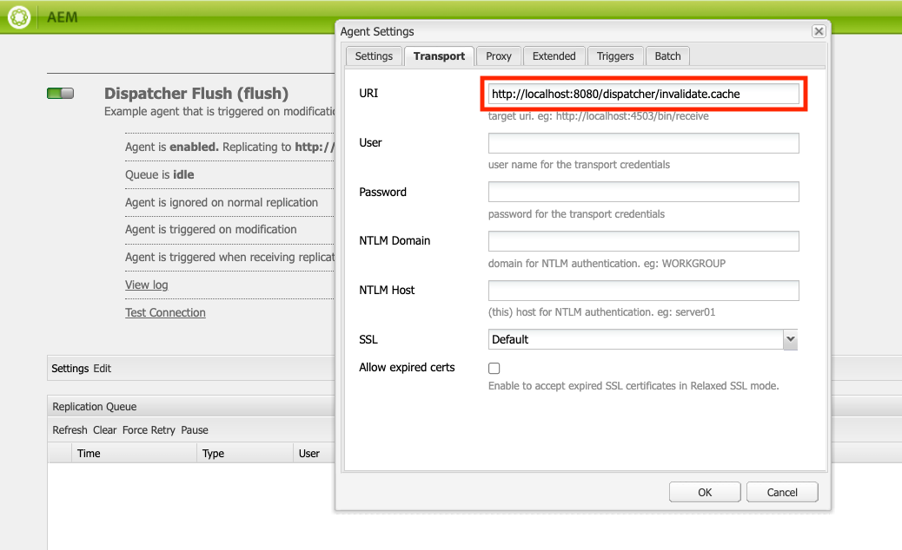
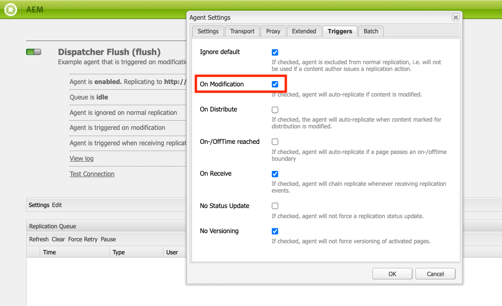
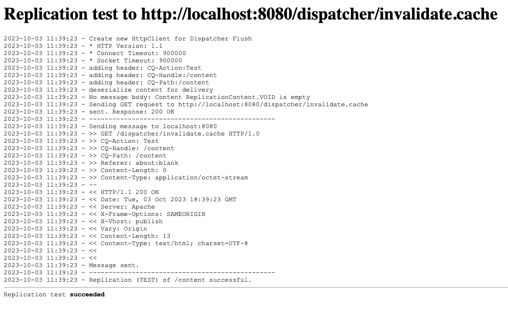
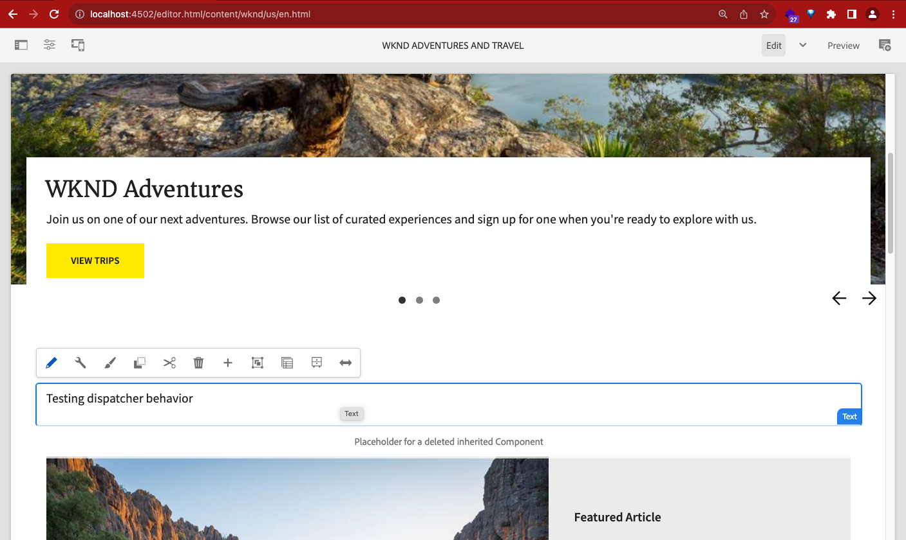
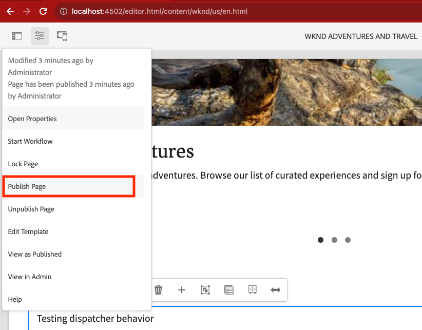
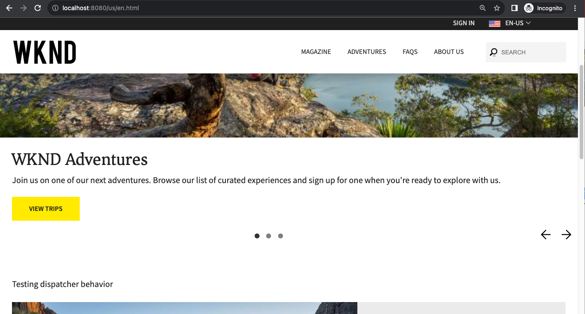

# Set up local AEMaaCS SDK Stack for Dispatcher Troubleshooting

This enablement will walk you through the process of running the AEMaaCS Dispatcher SDK on a local environment. Doing this has the following benefits over testing configurations in a hosted CS program environment

* A hot reload script can immediately deploy modified configurations as soon as they are saved to the local dispatcher. This allows testing changes within seconds.
  * *Windows SDK does not have hot reload, however manual deployment of changes is fast*
* The filesystem can be viewed directly in Docker interface, making it easy to inspect  
cache files and understand nuances of behavior (statfileslevel, TTL, Sling Dynamic Include, Permission Sensitive Cache, etc.)
* AEMaaCS environments do not allow for log level settings lower than debug. In some cases, this makes troubleshooting extremely difficult.
  * The recommend level for debugging Rewrites is trace2 or lower. This is only possible in local SDK.

> Skill level: 101 - Basic to Intermediate

The skills practiced in this session are:

* AEM Developer - Local Setup and IDE
* Docker
* Git Repository - Basic

Prerequisites

* Java 11 installed and version verified by command line
* Github Desktop or similar git client installed
* Visual Studio Code IDE installed (or your preferred IDE for advanced users)

> Note that `~` is used as shorthand for the User's Directory. In Windows, this is the equivalent of `%HOMEPATH%`.

## Download the AEM as a Cloud Service SDK

The AEM as a Cloud Service SDK, or AEM SDK, contains the Quickstart Jar used to run AEM Author and Publish locally for development, as well as the compatible version of the Dispatcher Tools.

1. Log in to [https://experience.adobe.com/#/downloads](https://experience.adobe.com/#/downloads) with your Adobe ID
    * Note that your Adobe Organization __must__ be provisioned for AEM as a Cloud Service to download the AEM as a Cloud Service SDK.
1. Navigate to the __AEM as a Cloud Service__ tab
1. Sort by __Published Date__ in __Descending__ order
1. Click on the latest __AEM SDK__ result row
1. Review and accept the EULA, and tap the __Download__ button

## Extract the Quickstart Jar from the AEM SDK zip

1. Unzip the downloaded `aem-sdk-XXX.zip` file

## Set up local AEM Author service

The local AEM Author Service provides developers with a local experience digital marketers/content authors will share to create and manage content.  AEM Author Service is designed both as an authoring and preview environment, allowing most validations of feature development can be performed against it, making it a vital element of the local development process.

1. Create the folder `~/aem-sdk/author`
1. Copy the __Quickstart JAR__ file to  `~/aem-sdk/author` and rename it to `aem-author-p4502.jar`
1. Start the local AEM Author Service by executing the following from the command line:
   * `java -jar aem-author-p4502.jar`
     * Provide the admin password as `admin`. Any admin password is acceptable, however its recommend to use the default for local development to reduce the need to re-configure.

    You *cannot* start the AEM as Cloud Service Quickstart Jar [by double-clicking](#troubleshooting-double-click).

**MacOS**

  ```shell
  $ mkdir -p ~/aem-sdk/author
  $ cp aem-sdk-Quickstart-XXX.jar ~/aem-sdk/author/aem-author-p4502.jar
  $ cd ~/aem-sdk/author
  $ java -jar aem-author-p4502.jar
  ```

**Windows**

  ```shell
  $ mkdir -p c:\Users\<My User>\aem-sdk\author
  $ copy aem-sdk-Quickstart-XXX.jar c:\Users\<My User>\aem-sdk\author\aem-author-p4502.jar
  $ cd c:\Users\<My User>\aem-sdk\author
  $ java -jar aem-author-p4502.jar
  ```

## Set up local AEM Publish service

The local AEM Publish Service provides developers with the local experience end-users of the AEM will have, such as browsing the Web site hosed on AEM. A local AEM Publish Service is important as it integrates with AEM SDK's [Dispatcher tools](./dispatcher-tools.md) and allows developers to smoke-test and fine-tune the final end-user facing experience.

1. Create the folder `~/aem-sdk/publish`
1. Copy the __Quickstart JAR__ file to  `~/aem-sdk/publish` and rename it to `aem-publish-p4503.jar`
1. Start the local AEM Publish Service by executing the following from the command line:
    * `java -jar aem-publish-p4503.jar`
      * Provide the admin password as `admin`. Any admin password is acceptable, however its recommend to use the default for local development to reduce the need to re-configure.

    You *cannot* start the AEM as Cloud Service Quickstart Jar [by double-clicking](#troubleshooting-double-click).
1. Access the local AEM Publish Service at [http://localhost:4503](http://localhost:4503) in a Web browser

**MacOS**

```shell
$ mkdir -p ~/aem-sdk/publish
$ cp aem-sdk-Quickstart-XXX.jar ~/aem-sdk/publish/aem-publish-p4503.jar
$ cd ~/aem-sdk/publish
$ java -jar aem-publish-p4503.jar
```

**Windows**

```shell
$ mkdir -p c:\Users\<My User>\aem-sdk\publish
$ copy aem-sdk-Quickstart-XXX.jar c:\Users\<My User>\aem-sdk\publish\aem-publish-p4503.jar
$ cd c:\Users\<My User>\aem-sdk\publish
$ java -jar aem-publish-p4503.jar
```

## Install WKND Reference site on Author and Publish Services

In this section, we will check out the WKND Reference Project source code using Github Desktop and install to our running AEM Services

1. In Github Desktop, click File > Clone Repository
1. Click the URL tab, then enter [https://github.com/adobe/aem-guides-wknd](https://github.com/adobe/aem-guides-wknd) as the Repository URL.
   * A Local Path will automatically populate. Note this path for later use. E.g. /Users/*username*/Documents/GitHub/aem-guides-wknd
   * Click OK to check out the repository
1. In Visual Studio Code, click File > Open Folder. Select the top level folder aem-guides-wknd noted above
1. Still in VS Code, open the Terminal menu and select New Terminal
1. Install the WKND code to Author and Publish by using the below commands. This should be done **one at a time**, waiting for each install to complete

```shell
mvn clean install -PautoInstallSinglePackage

mvn clean install -PautoInstallSinglePackagePublish
```

## Set up Dispatcher in Docker with WKND configurations

### Extract the Dispatcher Tools from the AEM SDK zip

> Windows users cannot have any spaces or special characters in the path to the folder containing the Local Dispatcher Tools. If spaces exist in the path, the `docker_run.cmd` fails.

The version of Dispatcher Tools is different from that of the AEM SDK. Ensure that the version of Dispatcher Tools is provided via the AEM SDK version matching the AEM as a Cloud Service version.

1. Unzip the downloaded `aem-sdk-xxx.zip` file
1. Unpack the Dispatcher Tools into `~/aem-sdk/dispatcher`

**macOS**

```shell
$ chmod a+x aem-sdk-dispatcher-tools-x.x.x-unix.sh
$ ./aem-sdk-dispatcher-tools-x.x.x-unix.sh
```

**Window**

Unzip `aem-sdk-dispatcher-tools-x.x.x-windows.zip` into `C:\Users\<My User>\aem-sdk\dispatcher` (creating missing folders as needed).

### Start the Dispatcher using WKND configurations

1. In Visual Studio Code, where aem-guides-wknd was previously opened, right click the folder **/dispatcher/src** and select **Copy Path**. This will be used in the command to start Dispatcher
2. Open a Terminal window at the location of your unzipped dispatcher SDK, ~/aem-sdk/dispatcher
3. Run the below command. This must be updated with your WKND dispatcher src path from Step 1

**MacOS**

```shell
./bin/docker_run_hot_reload.sh /Users/{username}/Documents/GitHub/aem-guides-wknd-fork/dispatcher/src host.docker.internal:4503 8080
```

**Windows**

```shell
bin\docker_run <src-folder> <aem-publish-host>:<aem-publish-port> <dispatcher-port>
```

## Simulate Content Distribution

In a true Cloud Service environment content is distributed from the Author Service to the Publish Service using [Sling Content Distribution](https://sling.apache.org/documentation/bundles/content-distribution.html) and the Adobe Pipeline. The [Adobe Pipeline](https://experienceleague.adobe.com/docs/experience-manager-cloud-service/core-concepts/architecture.html?lang=en#content-distribution) is an isolated microservice available only in the cloud environment.

During local development, we must simulate the distribution of content using the local Author and Publish service. This can be achieved by enabling the legacy Replication agents.

> Replication agents are only available to use in the local Quickstart JAR and provide only a simulation of content distribution.

1. Login to the **Author** service and navigate to [http://localhost:4502/etc/replication/agents.author.html](http://localhost:4502/etc/replication/agents.author.html).
1. Click **Default Agent (publish)** to open the default Replication agent.
1. Click **Edit** to open the agent's configuration.
1. Under the **Settings** tab, update the following fields:

    * **Enabled** - check true
    * **Agent User Id** - Leave this field empty

    

1. Under the **Transport** tab, update the following fields:

    * **URI** - `http://localhost:4503/bin/receive?sling:authRequestLogin=1`
    * **User** - `admin`
    * **Password** - `admin`

    

1. Click **Ok** to save the configuration and enable the **Default** Replication Agent.
1. You can now make changes to content on the Author service and publish them to the Publish service.
  

1. However, these changes do not yet trigger a dispatcher flush to clear cashed copies. To enable this, we start by configuring the dispatcher SDK running in docker to allow flush requests from localhost. In the relevant vhost configuration for your site, we will add a temporary "allow" entry. Using WKND Reference as an example, open **dispatcher/src/conf.dispatcher.d/available_farms/wknd.farm**

    ```dispatcher
    /allowedClients {
      $include "../cache/default_invalidate.any"

      #Temporary rule to allow sdk docker flush.
      #REMOVE BEFORE MERGING INTO ANY PIPELINE BRANCH
      /0003 {
        /type "allow"
        /glob "*.*.*.*"
      }
    }
    ```

1. Next, login to the **Publish** service and navigate to [http://localhost:4503/etc/replication/agents.  publish.html](http://localhost:4503/etc/replication/agents.publish.html).

1. Under the **Settings** tab, update the following fields:

    * **Enabled** - check true

    

1. Under the **Transport** tab, update the following fields:

    * **URI** - http://localhost:8080/dispatcher/invalidate.cache

    

1. Under the **Triggers** tab, update the following fields:

    * **On Modification** - check true

    

1. Click OK to close the Agent Settings dialog and apply changes. Next, click Test Connection to verify the flush request is successful.

    

## Verify Author to Publish Replication and Clearing of Cache

1. Open an InCognito browser, and enter the URL [http://localhost:8080/us/en.html](http://localhost:8080/us/en.html). This should cache a copy of this page in the local dispatcher. 

  >  **It is important that this is done using Incognito**. This is because you have logged in sessions for AEM in your normal browser. Because of this, the Dispatcher will likely see requests as having authentication.<br><br>The Dispatcher does not cache authenticated requests by default. We will explore this in future lessons, and you can learn more by visiting documentation on [Caching Secured Content in AEM.](https://experienceleague.adobe.com/docs/experience-manager-dispatcher/using/configuring/permissions-cache.html?lang=en)

1. Open the homepage for edit in Author at [http://localhost:4502/editor.html/content/wknd/us/en.html](http://localhost:4502/editor.html/content/wknd/us/en.html)

1. Make an edit by adding a Text component near the top of the page. We do this below the Hero image where the template has more allowed components. 
    
1. Publish the change using the menu at the top left of the editor window.
    
1. Returning to the terminal where your dispatcher is running, you should see a log statement indicating that publish received the replication, and in turn successfully flushed the cached copy in dispatcher. 

    ```Dispatcher Log
    172.17.0.1 "localhost:8080" - [05/Oct/2023:20:49:54 +0000] "GET /dispatcher/invalidate.cache HTTP/1.1" 200 13 "about:blank" "Jakarta Commons-HttpClient/3.1"
    [05/Oct/2023:20:49:54 +0000] "GET /dispatcher/invalidate.cache HTTP/1.1" 200 purge [publishfarm/-] 6ms "localhost:8080"
    ```

1. Reload the WKND homepage in your Incognito browser. The changes should now be seen.
    

## Next Steps - Dive in to Docker and Observe Dispatcher Behaviors

[Proceed to next lesson](dispatcher-behavior-basics.md)

### Additional Resources

* [Download AEM SDK](https://experience.adobe.com/#/downloads)
* [Adobe Cloud Manager](https://my.cloudmanager.adobe.com/)
* [Download Docker](https://www.docker.com/)
* [Experience Manager Dispatcher Documentation](https://experienceleague.adobe.com/docs/experience-manager-dispatcher/using/dispatcher.html)
