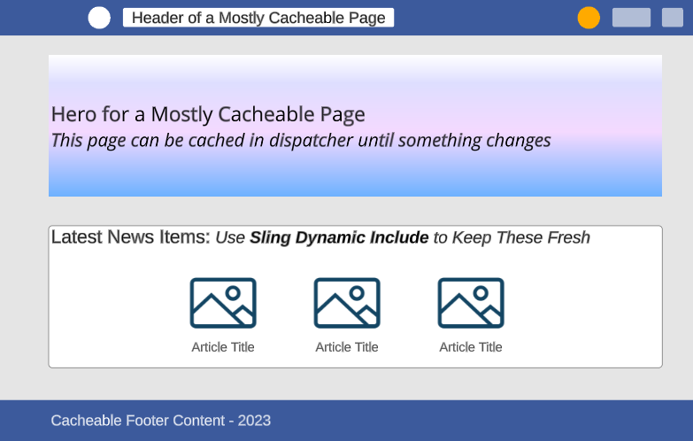
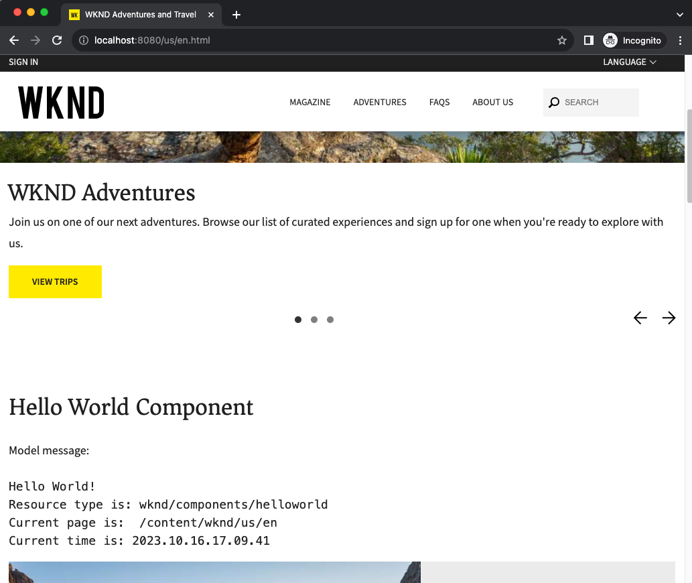
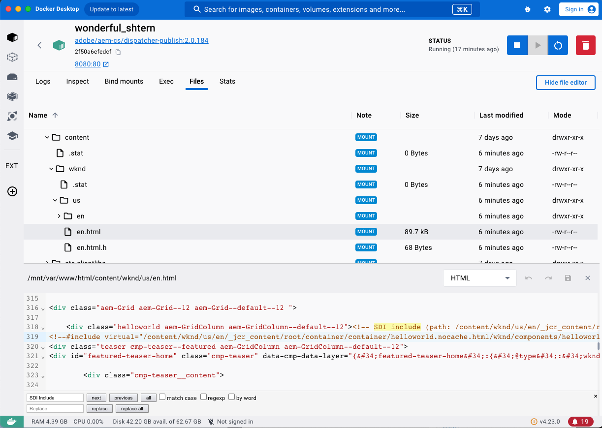
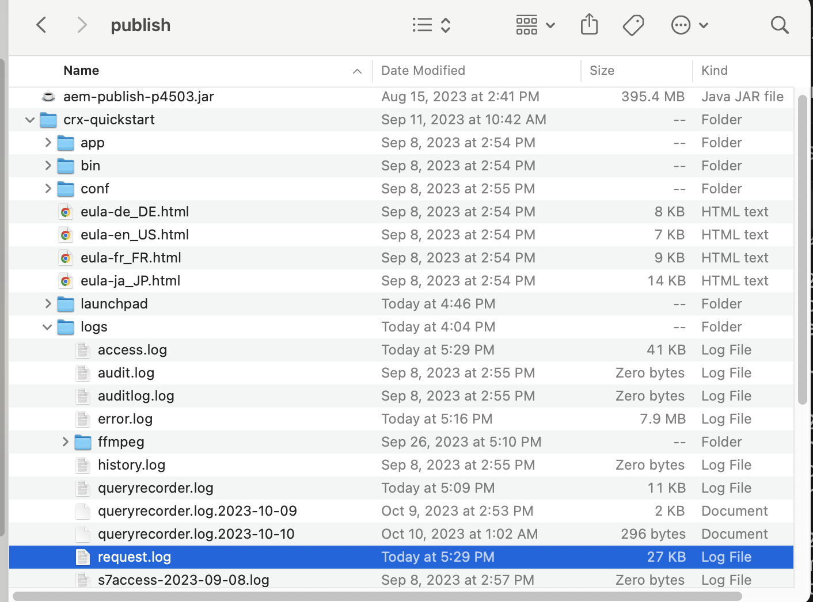
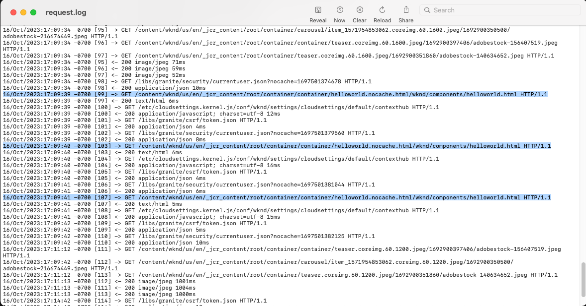
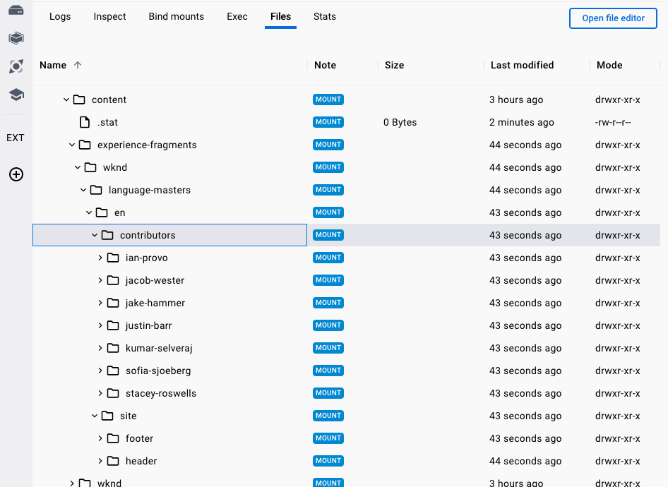
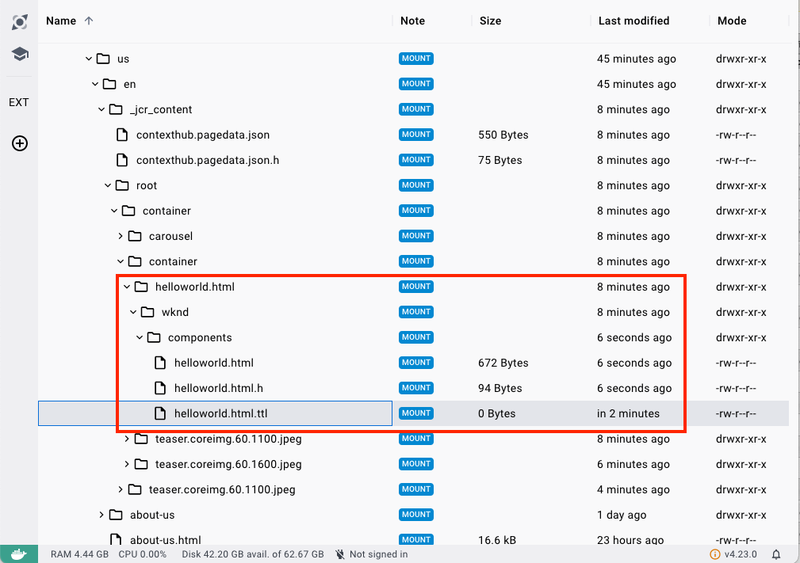

# Sling Dynamic Include in AEMaaCS

This tutorial will quickly allow you to deploy a fork of the AEM Guides WKND project configured for Sling Dynamic Include to understand concepts and try out settings. The example can be deployed to a local AEMaaCS SDK Stack (preferred) or an AEMaaCS Sandbox.

> Skill level: 202 - Intermediate to Advanced

Prerequisites

* A local AEMaaCS SDK Author/Publish/Dispatcher stack (preferred) or AEMaaCS Sandbox
  * *See [AEMaaCS Local Stack](local-aemaacs-stack.md) if you need to learn how*
  * *See [Dispatcher Behavior Basics](dispatcher-behavior-basics.md) if you're not familiar with navigating the Dispatcher in Docker Desktop*
  * *If you are going to revisit either of the above to set up for this tutorial, use the [WKND Branch for Sling Dynamic Include](https://github.com/holmsj/aem-guides-wknd/tree/feature/sling-dynamic-include) from this tutorial as you deploy code.*
* Your preferred Git client
* Visual Studio Code or other IDE
* Ability to build and deploy AEM projects using Maven

## Background

The purpose of Sling Dynamic Include, or SDI, is to dynamically replace sling includes with either server side includes, edge side includes or even JavaScript includes. This can be a very powerful tool, especially in the context of aem's dispatcher, as it pushes cache life granularity to the component level versus the page level.

To consider a use case, a website homepage may be cached in the dispatcher for hours at a time until changed content is published or AEMaaCS Pods recycle. But what if there is a requirement to display the three latest news articles from an external platform within the homepage?

With Sling Dynamic Include, the entire page can be cached with only the Latest News component being marked for dynamic inclusion. The dynamic section could be set to never be cached, thus requesting rendering from publish on every request. Alternately it could be set with a short TTL (Time to Live) in the Dispatcher cache to ensure freshness while reducing calls to the publish pods.



## But what about AEMaaCS?

Support for SDI in in AEM as a Cloud Service has been in a grey area of support, with confusion around whether it can be recommended. Some clarity has been given since its underlying Dispatcher module, mod_include, has been added to Supported Apache Modules in documentation. This does contain a caveat
> mod_include (no directives supported)

Despite this addition, SDI documentation found in Experience League is specific to AEM 6.5, where there are some unclear differences compared to setting up in AEMaaCS. As mentioned above, no mod_include directives are supported in CS, but this does not mean we're out of luck. Actually, mod_include is enabled by default and we don't need to bother with some steps shown in older 6.5 documentation.

## Basic Configuration and Code Example

A branch is prepared for this tutorial at [https://github.com/holmsj/aem-guides-wknd/tree/feature/sling-dynamic-include](https://github.com/holmsj/aem-guides-wknd/tree/feature/sling-dynamic-include). Check this branch out and open the top level project folder in your IDE.

Adding SDI to WKND for this tutorial took place in two commits. The first commit was largely boilerplate:

* The Hello World component was modified to return the current time and date. This is helpful to see that it is being loaded dynamically and is not cached with the rest of the page.
* As WKND uses the Maven Enforcer plug in, this change required numerous updates to pom file and bundle versions.
* It is not necesary for this tutorial, but you can optionally [view the commit here](https://github.com/adobe/aem-guides-wknd/commit/1838b5f05993b72976a96e0ce955bb8227323b70).

The second commit contained the changes specific to enabling Sling Dynamic Include in an AEMaaCS project. It contained 7 changed files, 2 of which are for tutorial purposes. This means SDI can be enabled for AEMaaCS with only 5 changed files! [View the changes here](https://github.com/adobe/aem-guides-wknd/commit/69bb7af0566084b66842f14f75c5c20d3c3fd748).

* **pom.xml**
  * Added top level dependency for **org.apache.sling.dynamic-include**
* **all/pom.xml**
  * Use filevault-package-maven-plugin to embed **org.apahce.sling.dynamic-include** and set application specific target for install to AEMaaCS environments.
  * Add dependency for the above package.
* **/dispatcher/src/conf.d/available_vhosts/wknd.vhost**
  * Add configurations to enable SDI Server Side Includes.
  * Removed Cache-Control header related directives. This is because Edge Side Include is not yet available in the AEMaaCS CDN, so for the purposes of this example we will simply avoid caching HTML outside the Dispatcher layer.
* **/dispatcher/src/conf.dispatcher.d/available_farms/wknd.vhost** *(Tutorial purpose only)*
  * Add allowedClients rules to allow dispatcher flush from localhost. This is for the purpose of localhost testing and should not be deployed to Cloud environments in real world use cases.
* **/dispatcher/src/conf.dispatcher.d/cache/rules.any**
  * Added a rule to disable caching of SDI included components using the ***.nocache.html** selector
* **ui.config/src/main/content/jcr_root/apps/wknd/osgiconfig/config.publish/org.apache.sling.dynamicinclude.Configuration~content.cfg.json**
  * Created OSGI configuration for publish runmode. We will look at this configuration in more detail, but at a high level it is configuring component **wknd/components/helloworld** for Sling Dynamic Include at the Dispatcher layer.
* **ui.content.sample/src/main/content/jcr_root/content/wknd/us/en/.content.xml** *(Tutorial purpose only)*
  * Add Hello World component to  our WKND /us/en home page sample content.

## Deploy to local Author/Publish/Dispatcher

> Note: If you need help with this section, revisit [AEMaaCS Local Stack](local-aemaacs-stack.md) and follow the steps using the WKND Sling Dynamic Include branch included with this tutorial when deploying.

1. In the AEM project root, run the following commands letting the first complete before running the second.

    ```shell
    mvn clean install -PautoInstallSinglePackage

    mvn clean install -PautoInstallSinglePackagePublish
    ```

1. Copy the path to the checked out WKND branch **/dispatcher/src** folder. This can easily be done in VS Code by right clicking the folder, and selecting *Copy Path*.

1. From a Terminal opened at the dispatcher SDK root, run the following command

    **MacOS**

    ```shell
    ./bin/docker_run_hot_reload.sh <PATH_COPIED_ABOVE> host.docker.internal:4503 8080
    ```

    **Windows**

    ```shell
    bin\docker_run <PATH_COPIED_ABOVE> host.docker.internal:4503 8080
    ```

## View Sling Dynamic Include in Action

1. Open an Incognito browser window, and navigate to [http://localhost:8080/us/en.html](http://localhost:8080/us/en.html)
1. You should see a Hello World component included in the page as shown below. If you do not, you may need to trigger a cache flush by opening the [/content/wknd/en/us page in Author Edit](http://localhost:4502/editor.html/content/wknd/us/en.html), then publishing the page. Reload the page at localhost:8080 in Incognito browser.
  
1. Once you are seeing the page with Hello World component, you should be able to reload the page multiple times and see that the current time always updates in the component, but the page loads very quickly as the rest of it is cached.
1. Next, open Docker Desktop to see how SDI works.
1. In the **Files** tab, navigate to **/mnt/var/www/html/content/wknd/us/en.html**
1. Right click **en.html** and select **Edit File**
1. Search the cache file's contents by pressing Cmd+F (Ctrl+F in Windows) and entering ```SDI indclude```
1. We can see the wrapping ```<div class="helloworld ...``` element, containing a **virtual include** statement. This is instructing the Dispatcher to dynamically fetch a copy of the Hello World component.
  
1. Open the request.log file under **../publish/crx-quickstart/logs/request.log**
  
1. The log as shown in the below screenshot indicates multiple requests for ```/content/wknd/us/en/_jcr_content/root/container/container/helloworld.nocache.html/wknd/components/helloworld.html```
  However, we see fewer requests to the page.<br><br>This is because the page is cached in dispatcher, but the Hello World component is not cached due to the nocache.html selector added in the Sling Dynamic Include configuration for the component.
  

## Sling Dynamic Include of Experience Fragments

A fundamental feature of AEM is Experience Fragments. An Experience Fragment is a grouped set of components that when combined creates an experience. For example, the Header and Footer of a site is nearly always authored in Experience Fragments then included via Editable Templates.

There are a couple of optimizations we can consider in this area:

* When an Experience Fragment is on many pages, the publish server does not render it just once after every cache flush. It is re-rendered in the context of every single page that references it.
* In some cases, there could be different content in the Header based on groups of a logged in user. In this case, caching it would display the same content to all users. *(Note: this could be handled in a variety of ways, but SDI could be considered)*
* AEMaaCS has some complexities with Experience Fragments.
  * If you edit a fragment under **/content/experience-fragments/wknd** and publish the changes, this does not clear the pages cached **/content/wknd/**
  * This results in cached pages that contain the fragment displaying outdated cached content from it.
  * *Learn about statfileslevel in [Understanding Dispatcher Using Docker](dispatcher-behavior-basics.md)*

### Create Configurations for XFs

To enable SDI for Experience Fragments, we will create two OSGI configurations for **org.apache.sling.dynamicinclude.Configuration**

1. Navigate to **ui.config/src/main/content/jcr_root/apps/wknd/osgiconfig/config.publish**
1. Create a file under this path named ```org.apache.sling.dynamicinclude.Configuration~xf-content.cfg.json```
1. Enter the below contents in the file.

    ```json
    {
      "include-filter.config.resource-types":[
        "wknd/components/xfpage"
      ],
      "include-filter.config.enabled":true,
      "include-filter.config.path":"/content",
      "include-filter.config.required_header":"Server-Agent=Communique-Dispatcher",
      "include-filter.config.include-type":"SSI",
      "include-filter.config.selector":"sharedcontent",
      "include-filter.config.extension":"html",
      "include-filter.config.add_comment":true,
      "include-filter.config.rewrite":true,
      "include-filter.config.appendSuffix":true,
      "include-filter.config.ignoreUrlParams=":[
        ""
      ]
    }
    ```

1. Create another file named ```org.apache.sling.dynamicinclude.Configuration~xf-conf.cfg.json```
1. Enter the below contents in the file.

    ```json
      {
        "include-filter.config.resource-types":[
          "wknd/components/xfpage"
        ],
        "include-filter.config.enabled":true,
        "include-filter.config.path":"/conf",
        "include-filter.config.required_header":"Server-Agent=Communique-Dispatcher",
        "include-filter.config.include-type":"SSI",
        "include-filter.config.selector":"sharedcontent",
        "include-filter.config.extension":"html",
        "include-filter.config.add_comment":true,
        "include-filter.config.rewrite":true,
        "include-filter.config.appendSuffix":true,
        "include-filter.config.ignoreUrlParams=":[
          ""
        ]
      }
    ```

1. There are a few properties above to pay special attention to:
    * **include-filter.config.resource-types**
      * Gives the publish server instructions to replace these components with virtual include instructions to be carried out in the Dispatcher.
    * **include-filter.config.path**
      * This will apply the configuration only for requests under that path. We do this for **/content** to cover regular pages, and **/conf** for instances of the component which are included in the Structure of Editable Templates stored under that path.
    * **include-filter.config.include-type**
      * **SSI** value Instructs SDI to work as a Server Side Include (in the Dispatcher). We will explore other options later in the tutorial.
    * **include-filter.config.selector**
      * In the Hello World component, we used **nocache** as a selctor to be added for SDI requests. This prevented the component request from ever being cached.
      * In this case, we are using a different selector **sharedcontent** because we *do* want the Experience Fragment to be cached, but separately from the rest of the page.
1. Run a build (or export using VS Code plugin) of these updated configurations to publish using the command ```mvn clean install -PautoInstallSinglePackagePublish```

### Verify Dynamic Include of Experience Fragments

1. Once the build completes, trigger a cache flush by opening the [/content/wknd/en/us page in Author](http://localhost:4502/editor.html/content/wknd/us/en.html), then publishing the page.
1. Rather than looking at the homepage, open the Abous Us page. Do this in your Incognito browser using ```http://localhost:8080/us/en/about-us.html```
1. On this page we see several WKND Contributors included as Experience Fragments. 
1. Open Docker Desktop in **Files** tab, and Navigate to **/mnt/var/www/html/content/experience-fragments/wknd/language-masters/en/** and review the new file structure under this path.
1. Looking at this structure, we can see that we have Experience Fragments in the file structure. These are cached and delivered separately via SDI, where they were previously rendered and served as part of pages. 
1. Below this structure, the **contributors** and **site header/footer** Experience Fragments can be seen.

## Do Some Experimenting

Now that your environment is configured and you have some understanding, try some different settings and scenarios.

1. Change include-filter.config.include-type from ```SSI``` to ```JSI```.
    *  What does this virtual include look like when viewing cached page's html in the Dispatcher cache file structure? How about browser network requests? *Hint: filter for Doc or HTML requests*
1. In this tutorial, we configured our Experience Fragments to be cached and reused separate from pages.
    * What if some Experience Fragments contain components which refer to context aware configurations, thus must be rendered within the page?
    *  As a developer, how would you allow for both types of Experience Fragments?

## Extra Credit - Use ACS Commons Dispatcher TTL on Hello World Component

The AEMaaCS Project Archetype dispatcher configurations contain a setting called **enableTTL**, which is enabled by default. [Caching in AEM as a Cloud Service](https://experienceleague.adobe.com/docs/experience-manager-cloud-service/content/implementing/content-delivery/caching.html?lang=en) states:
> Rules can be applied to the Dispatcher configuration to modify any default cache expiration settings, resulting in caching at the CDN. Dispatcher also respects the resulting cache expiration headers if enableTTL is enabled in the Dispatcher configuration, implying that it refreshes specific content even outside of content being republished.

This can be a source of confusion, as we are often applying cache control headers within Dispatcher vhosts to control CDN behavior. This alone will not result in TTL based expiration in the Dispatcher's cache. For TTLs to be respected in the Dispatcher layer, there must be a cache-control header added via the publish server. This could happen via custom code, such as a Sling Filter or in a Servlet, but there is an easier way via the [ACS Commons Dispatcher TTL](https://adobe-consulting-services.github.io/acs-aem-commons/features/dispatcher-ttl/) feature.

To use ACS commons in a real AEMaaCS environment, it must be included in the project via Maven configurations and installed through the Pipeline. For simplicity of this tutorial, it is possible to simply install using Package Manager on the local publish environment.

1. Download the latest release of ACS Commons **acs-aem-commons-all-6.x.x.zip** from GitHub at [https://github.com/Adobe-Consulting-Services/acs-aem-commons/releases](https://github.com/Adobe-Consulting-Services/acs-aem-commons/releases)/
1. Open Package Manager on the local Publish server at [http://localhost:4503/crx/packmgr/index.jsp](http://localhost:4503/crx/packmgr/index.jsp)
    * You may need to log in at [http://localhost:4503/libs/granite/core/content/login.html](http://localhost:4503/libs/granite/core/content/login.html)
1. Install the package downloaded in step 1.
1. In your IDE, navigate to **ui.config/src/main/content/jcr_root/apps/wknd/osgiconfig/config.publish**
1. Create OSGI configuration file named **com.adobe.acs.commons.http.headers.impl.DispatcherMaxAgeHeaderFilter~hello-world.cfg.json**
1. Enter the below contents and save the file.

    ```json
    {
      "filter.pattern":[
        "/content/wknd/(.*)_jcr_content(.*)/helloworld.html"
      ],
      "max.age": 120
    }
    ```

1. In the above configuration
    * The TTL is being set to 120 seconds (2 minutes)
    * A filter pattern is set to match instances of the helloworld component under a page's content node (_jcr_content)
1. Now we must adjust the SDI configuration for this compponent. Edit **ui.config/src/main/content/jcr_root/apps/wknd/osgiconfig/config.publish/org.apache.sling.dynamicinclude.Configuration~content.cfg.json**
    * Remove the **nocache** value from selector property to match:

    ```json
    "include-filter.config.selector":"",
    ```

1. Run a build (or export using VS Code plugin) with these updated configurations to publish using the command ```mvn clean install -PautoInstallSinglePackagePublish```
1. Trigger a cache flush by modifying and re-publishing the page at **/content/wknd/en/us**
1. Reload the homepage in Incognito browser window at [http://localhost:8080/us/en.html](http://localhost:8080/us/en.html)
1. Open Docker Desktop **Files** tab, and Navigate to **/mnt/var/www/html/content/wknd/us/en/_jcr_content/root/container/container/helloworld.html/wknd/components/helloworld** and review the new file structure under this path.
  
